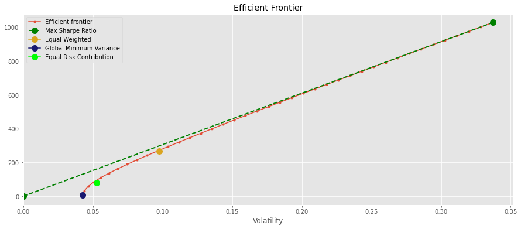
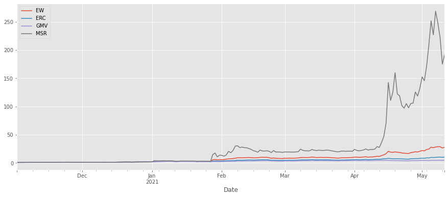
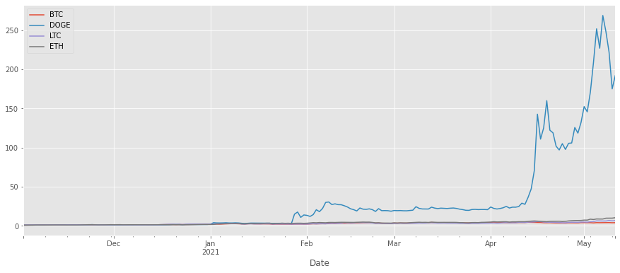

# portfolio-analysis-crypto
Portfolio Construction Techniques for 4 major crypto currencies

### Portfolios' performance

| Portfolio | Annualized Return | Annualized Vol | Sharpe Ratio | Max Drawdown |
|-----------|-------------------|----------------|--------------|--------------|
| EW        | 80.39235          | 1.55133        | 50.80763     | -0.14022     |
| ERC       | 21.29537          | 0.83385        | 25.02010     | -0.14949     |
| GMV       | 7.09049           | 0.67401        | 10.28621     | -0.14371     |
| MSR       | 1028.29092        | 5.35077        | 188.46271    | -0.38532     |

### Individual Assets' performance

| Asset | Annualized Return | Annualized Vol | Sharpe Ratio | Max Drawdown |
|-------|-------------------|----------------|--------------|--------------|
| BTC   | 5.47304           | 0.68224        | 7.83728      | -0.13431     |
| DOGE  | 1028.29092        | 5.35077        | 188.46271    | -0.38532     |
| LTC   | 11.60755          | 0.99450        | 11.42519     | -0.18297     |
| ETH   | 21.27597          | 0.87836        | 23.73030     | -0.19383     |
